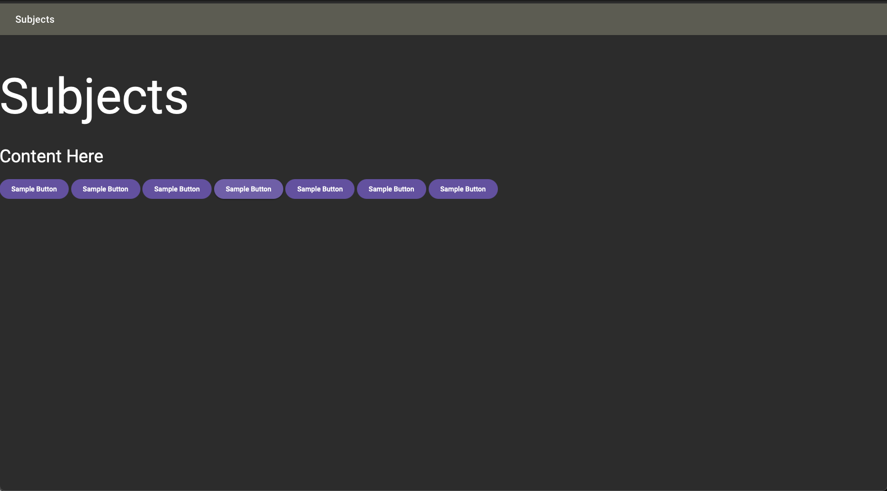
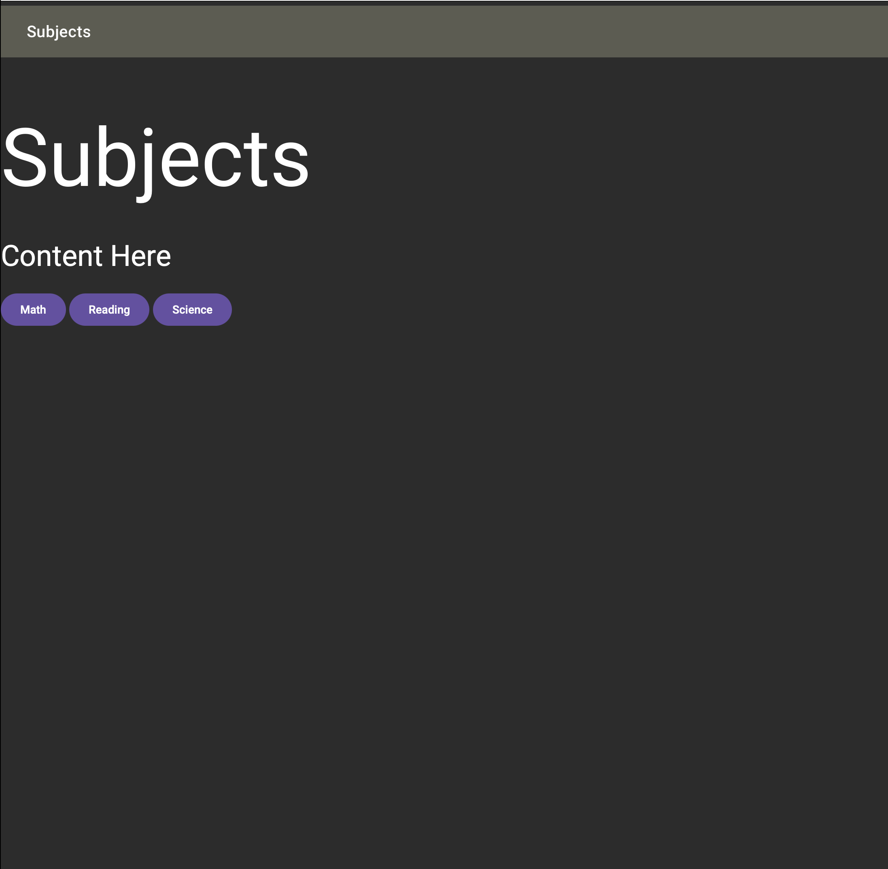
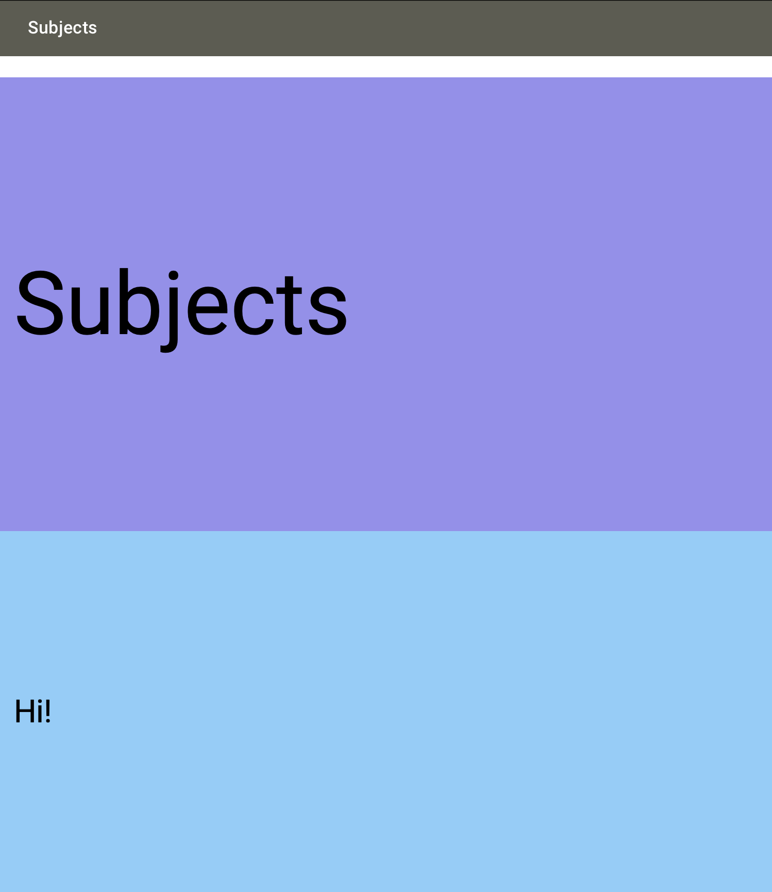
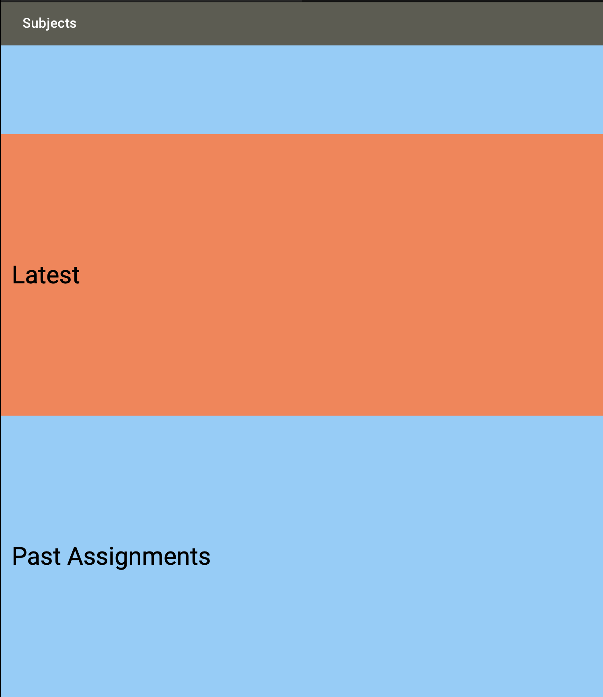
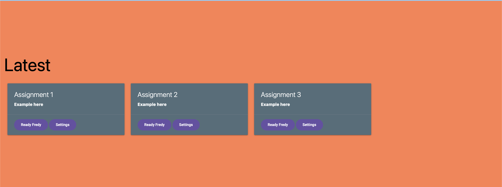
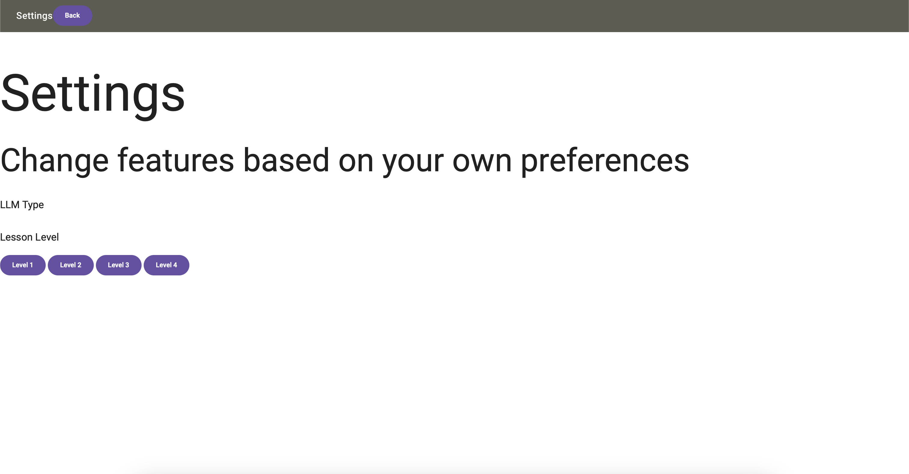

# subjects

## What is it?
 
> Subjects is a platform in Smith-Pad, allowing students with special needs 
> to learn a subject using many forms of learning, such as tactile learning,
> visual learning, and auditory learning.

## How does it work?
> Using AI technologies, teachers and paraprofessionals will able to simply
> prompt AI to create a lesson plan. 

## Is it cross platform? Compatibility?

> In Subjects, we are planning to create native apps with native components
> that are designed for each native operating system. Rather than having 
> a cross platform based on electron, we want to respect by creating apps
> based on each of the Operating System's native App UI style guidelines. 

### Android

### iOS

### macOS

### Windows

<ul></ul>

<ul></ul>

<ul></ul>

<ul></ul>

<ul></ul>

## Installation Instructions

In this section, we are going to be be talking about the installation instructions.

### In MacOS

Make sure that brew is installed
